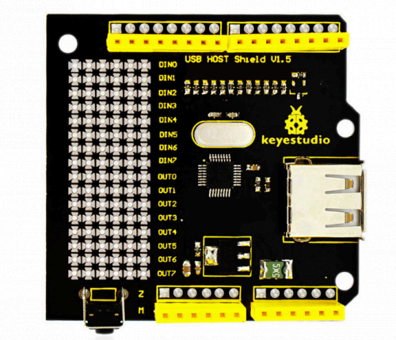
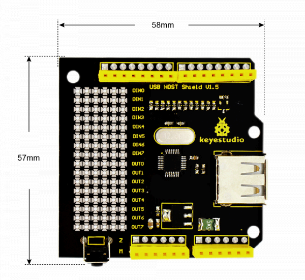
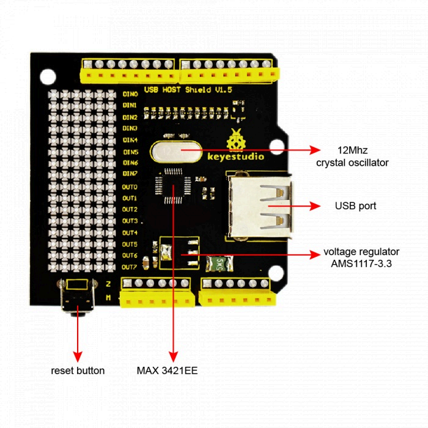
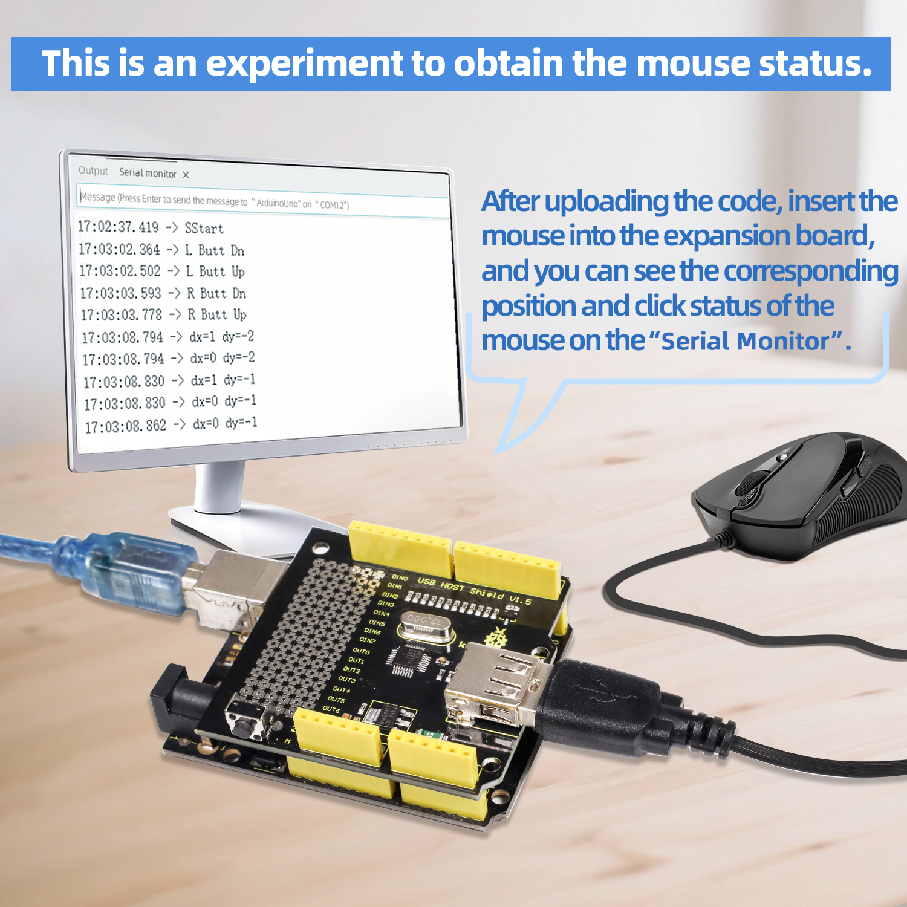
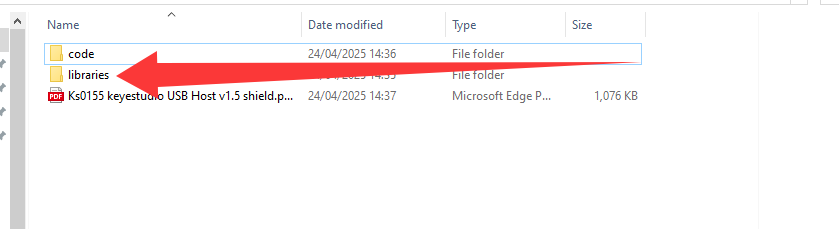
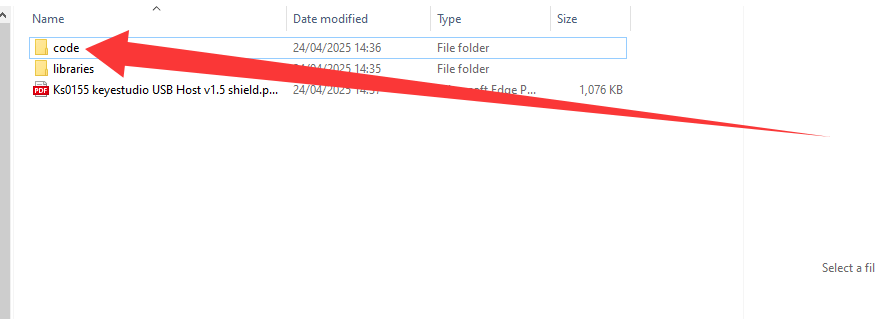
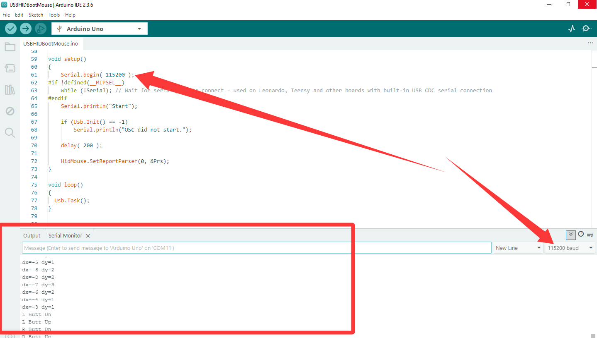

Ks0155 keyestudio USB Host v1.5 shield

## Introduction

keyestudio USB Host shield V1.5 is an Arduino USB Host expansion board. It can be plugged into the Arduino development board directly to make the Arduino equipped with USB Host function. The Arduino with Host function can communicate with USB devices, such as U keyboard, mouse, and so on.




## Specification

- Compatible with UNO R3 and MEGA 2560 control board.

- Realizing the USB Host function, enable to communicate with other USB devices and support the USB HUB function.

- Onbaord comes with double-sided through-hole pad, welding the electronic elements and setting the prototype circuit.

  

## Product Size and Pinout

- Dimensions: 58mm *57mm *17mm

- Weight: 18g

  

  

  






## Code testing

1. import the library file of this information (picture location for the library file location)



2. open the Arduino IDE software, upload the picture location code (this code test version for 2.3.6)

   

   Below is the code display for the above location, please upload the code for the above location, to ensure the code is correct, do not copy and upload this code.

   ```
   #include <hidboot.h>
   #include <usbhub.h>
    
   // Satisfy the IDE, which needs to see the include statment in the ino too.
   #ifdef dobogusinclude
   #include <spi4teensy3.h>
   #endif
   #include <SPI.h>
    
   class MouseRptParser : public MouseReportParser
   {
       protected:
           void OnMouseMove (MOUSEINFO *mi);    
           void OnLeftButtonUp (MOUSEINFO *mi);
           void OnLeftButtonDown (MOUSEINFO *mi);
           void OnRightButtonUp (MOUSEINFO *mi);
           void OnRightButtonDown (MOUSEINFO *mi);
           void OnMiddleButtonUp (MOUSEINFO *mi);
           void OnMiddleButtonDown (MOUSEINFO *mi);
   };
   
   void MouseRptParser::OnMouseMove(MOUSEINFO *mi)
   {
       Serial.print("dx=");
       Serial.print(mi->dX, DEC);
       Serial.print(" dy=");
       Serial.println(mi->dY, DEC);
   };
   
   void MouseRptParser::OnLeftButtonUp (MOUSEINFO *mi)
   {
       Serial.println("L Butt Up");
   };
   
   void MouseRptParser::OnLeftButtonDown (MOUSEINFO *mi)
   {    
   	Serial.println("L Butt Dn");
   };
   
   void MouseRptParser::OnRightButtonUp (MOUSEINFO *mi)
   {
       Serial.println("R Butt Up");
   };
   
   void MouseRptParser::OnRightButtonDown (MOUSEINFO *mi)
   {
       Serial.println("R Butt Dn");
   };
   
   void MouseRptParser::OnMiddleButtonUp (MOUSEINFO *mi)
   {
       Serial.println("M Butt Up");
   };
   
   void MouseRptParser::OnMiddleButtonDown (MOUSEINFO *mi)
   {
       Serial.println("M Butt Dn");
   };
    
   USB Usb;USBHub Hub(&Usb);
   HIDBoot<USB_HID_PROTOCOL_MOUSE> HidMouse(&Usb);
    
   MouseRptParser Prs;
    
   void setup()
   {
       Serial.begin( 115200 );
       #if !defined(__MIPSEL__)
       while (!Serial); // Wait for serial port to connect - used on Leonardo, Teensy and other boards with built-in USB CDC serial connection
       #endif
       Serial.println("Start");
     
       if (Usb.Init() == -1)
         Serial.println("OSC did not start.");
     
       delay( 200 );
     
       HidMouse.SetReportParser(0, &Prs);
   }
    
   void loop()
   {
       Usb.Task();
   }
   ```
   
   3. After uploading the code, connect the mouse to the USB port of the expansion board, open
   
      the serial monitor and set the baud rate to “115200”, at this time, you can see the operation of
   
      the mouse in the serial monitor (moving, sliding the wheel, left-click or right-click).
   
      

